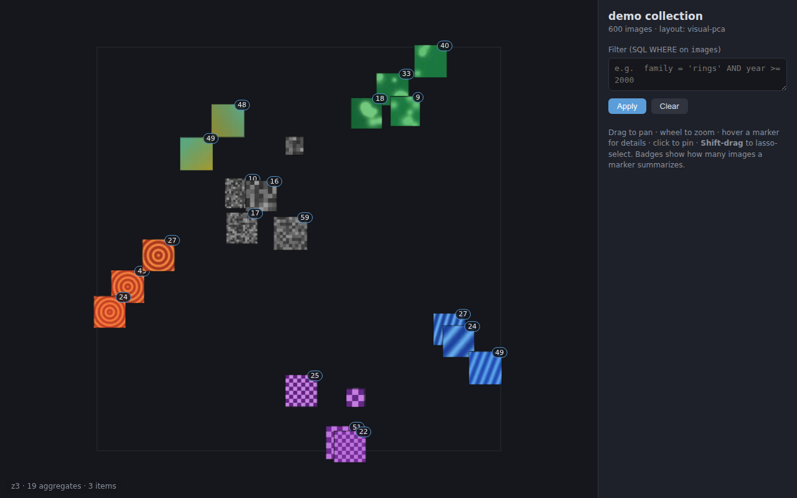

# Image Atlas

Local-first, offline exploration of **large image collections** (tested at
1M points, used in production at ~400k images) on a fixed 2D map, with SQL
metadata filtering, lasso selection, and representative-thumbnail
aggregation. A successor experiment to the
[Collection Space Navigator](https://github.com/Collection-Space-Navigator/CSN)
idea, rebuilt around tile-based aggregation so it scales.



**How it works in one paragraph:** an offline *build* stage turns your
images into a self-contained dataset bundle (a raw sprite store, 512px
detail previews, fixed 2D coordinates, quadtree tile indexes, SQLite
metadata). A read-only *serve* stage opens that bundle in your browser:
every visible map tile shows either its few images or one representative
thumbnail + a count badge, and the server packs exactly the sprites each
view needs into one small image — so a screenful costs ~100–400 KB of
transfer no matter how big the collection is (it works well even over an
SSH tunnel). Filters never move points — they only change what is
visible — so you keep your spatial memory of the collection.

**Dependencies:** Python ≥ 3.10, `numpy`, `Pillow`. Nothing else. The
frontend is plain HTML/JS/Canvas2D with no build step. Everything runs on
`127.0.0.1`; no cloud, no telemetry.

## Quick start (bundled example)

A tiny 300-image example dataset ships with the repo:

```bash
git clone https://github.com/evoluchico/image-atlas
cd image-atlas
python -m atlas serve example
```

A browser tab opens. **Drag** to pan, **wheel** to zoom, **hover** a
marker for details, **click** to pin, **Shift-drag** to lasso-select
(then export the selection as CSV from the side panel). Try a filter:

```sql
family = 'rings' AND year >= 2010
```

To generate a bigger synthetic playground:

```bash
python -m atlas demo --out /tmp/atlas-demo --count 5000
python -m atlas serve /tmp/atlas-demo/dataset
```

## Your own collection

### 1. Build (offline — decodes every image once, the slow part)

```bash
python -m atlas build \
    --images   /path/to/images \      # scanned recursively
    --metadata metadata.csv \         # optional
    --coords   coords.csv \           # optional but recommended
    --workers  16 \
    --out      /path/to/dataset
```

- `--metadata` is a CSV with one column holding filenames/paths (matched
  automatically against your images by path, basename, or stem) plus any
  other columns. Column types are inferred; every column becomes
  filterable.
- `--coords` is a CSV `path,x,y` with your 2D layout — typically a UMAP
  or t-SNE of CLIP embeddings (any scale; coordinates are normalized to
  the unit square). **Without it**, a fallback layout is computed from
  image color statistics (PCA) — fine for testing, but embedding-based
  coordinates are what make the map semantically meaningful.
- `--files list.txt` (paths relative to `--images`, one per line)
  restricts the build to an exact file list — useful for excluding
  known-corrupt images while keeping IDs aligned with your coords.
- Other knobs: `--threshold` (images per tile before aggregating,
  default 8), `--max-zoom` (default 8), `--cell` (sprite size, default
  48 px), `--force`.

Throughput is roughly limited by image decoding: ~400k images take
~20 min with 24 workers on a fast machine.

### 2. Serve (instant, read-only)

```bash
python -m atlas serve /path/to/dataset [--port 8765] [--host 127.0.0.1] [--no-browser]
```

The server recomputes nothing. If the bundle is incomplete or from an
older format it refuses to start and tells you what to rebuild.

### Remote / headless use

On a headless machine (no `$DISPLAY`), `serve` skips the browser launch
automatically. The recommended way to view a dataset served on a remote
box is SSH port forwarding — private, no extra software:

```bash
# on your own machine
ssh -L 8765:localhost:8765 user@remote-host
# then open http://localhost:8765/ in your local browser
```

(Tip: in an already-open OpenSSH session, type `~C` then
`-L 8765:localhost:8765` to add the forward without reconnecting.)

Alternatively `--host 0.0.0.0` binds on all interfaces for direct LAN
access — but the server has **no authentication**, so prefer the SSH
tunnel for anything non-trivial.

### Filters

The filter box takes a SQL WHERE clause against the `images` table:
your metadata columns plus built-ins `id`, `path`, `width`, `height`.
Examples:

```sql
year = 2022 AND month = 10
topic LIKE '%vacina%'
width > height                -- landscape images only
```

## Example: a real CSN-style pipeline

`scripts/prep_telegram.py` shows the intended workflow for an existing
research dataset (CLIP embeddings → UMAP → atlas): it reads an aligned
embeddings `.npy` + paths `.json` produced by an upstream pipeline,
computes a UMAP (or PCA fallback) projection, derives metadata columns
(dates parsed from filenames, topic labels from a concept model), and
emits `files.txt`, `coords.csv`, `metadata.csv` ready for `atlas build`.
The paths in it are machine-specific — treat it as a template.

## Tests & benchmark

```bash
python -m unittest discover tests        # unit + end-to-end tests
python tests/bench_scale.py              # 1M-point hot-path benchmark
```

Measured at 1M points: unfiltered viewport ~0.4 ms, filtered ~15 ms,
cold SQL filter 40–140 ms (then cached).

## Project layout

```
atlas/        Python package
  build.py      preprocessing pipeline (images -> dataset bundle)
  server.py     local HTTP server: filtering, tile summarization, selection
  summarize.py  representative-selection heuristic (shared build/serve)
  demo.py       synthetic dataset generator
frontend/     index.html / app.js / style.css — no build step
scripts/      dataset-specific prep templates
tests/        test suite + 1M scale benchmark
example/      small prebuilt dataset for the quick start
DESIGN.md     the full design document — read before structural changes
```

## Design

[DESIGN.md](DESIGN.md) is the authoritative spec: dataset format,
algorithms, API, performance budget, and the reasoning behind every
architectural choice (including deliberate departures from an earlier
proposal — Canvas2D instead of WebGL, SQLite instead of DuckDB, a stdlib
HTTP server instead of a desktop framework).

## License

MIT — see [LICENSE](LICENSE).
